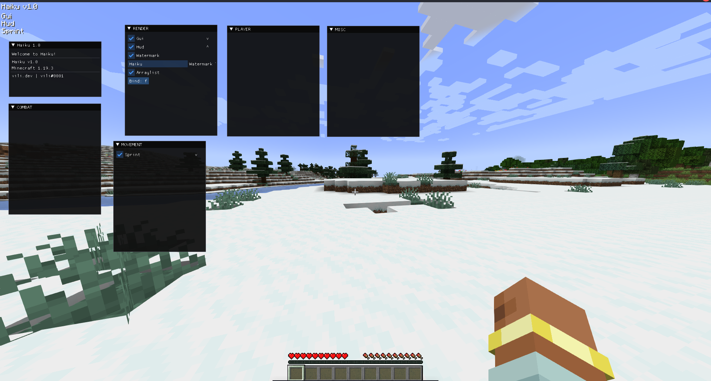
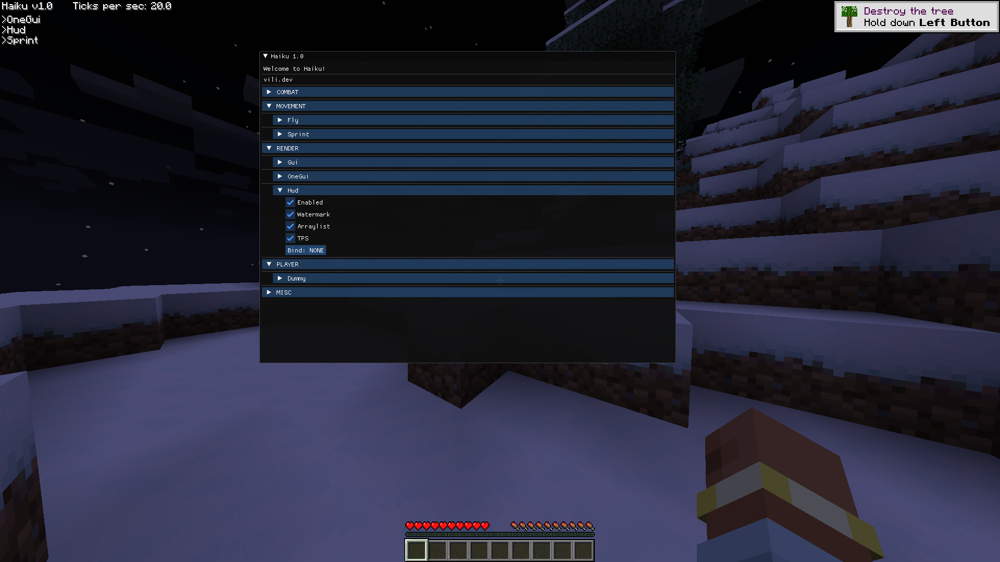

# Haiku

Base client for the latest Fabric version.

Gui uses [ImGui](https://github.com/SpaiR/imgui-java).

Feel free to use this for your own client.

## Images

    
click here

    
    

  

## Installation
1. Clone the repository `git clone https://github.com/V1li/haiku.git`
2. Open it with your favourite IDE.
3. run `gradlew genSources`

### Todo
Nothing at the moment. Feel free to open an issue or pull request.

### Done
- [x] Make a config manager.
- [x] Make example modules and a module manager.
- [x] Make example command and a command manager.
- [x] Make settings and a setting manager.
- [x] Make a gui for the client.
- [x] Make events and a eventbus.
- [x] Make the client work.

## Need help?
Open an issue or contact me via discord `v1li`.

-----------------------------
## Licence
> [This source code is under the GNU General Public License, version 3.](https://www.gnu.org/licenses/gpl-3.0.txt)