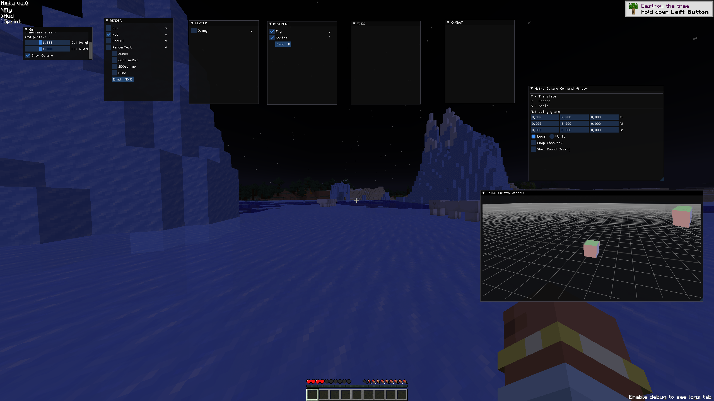
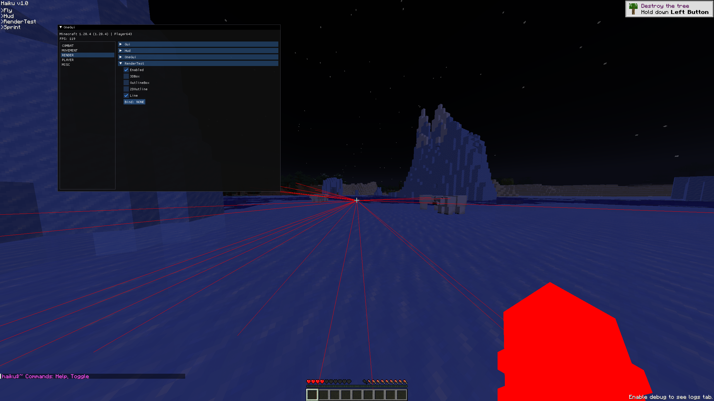

# Haiku

Open source base client for the latest Fabric version.

Gui uses [ImGui](https://github.com/SpaiR/imgui-java).

Feel free to use this for your own client. Also feel free to make pull requests to improve my code.

## Images

    
click here

    
    

  

## Installation
1. Make sure to have the [latest Java](https://www.oracle.com/java/technologies/downloads/) version installed.
2. Clone the repository `git clone https://github.com/vil/haiku.git`
3. Open it with your favourite IDE, such as Intellij Idea.
4. Run `gradlew genSources` or `./gradlew genSources` depending on your OS.
5. Happy coding!

## This base client has
- [x] a config manager.
- [x] example modules and a module manager.
- [x] example command and a command manager.
- [x] settings and a setting manager.
- [x] a gui for the client.
- [x] events and a eventbus.
- [x] rendering utility for making esp, tracer, etc.
- [x] it just works.

It has all the essentials for a client.

## Need help?
Open an issue or contact me via [discord](https://discord.com/users/224241396347961344).

You can find all the ImGui guides and documentation [here](https://github.com/SpaiR/imgui-java) & Fabric guides and documentation [here](https://fabricmc.net/wiki/start).

-----------------------------
## License
> [This source code is under the GNU General Public License, version 3.](https://www.gnu.org/licenses/gpl-3.0.txt)
